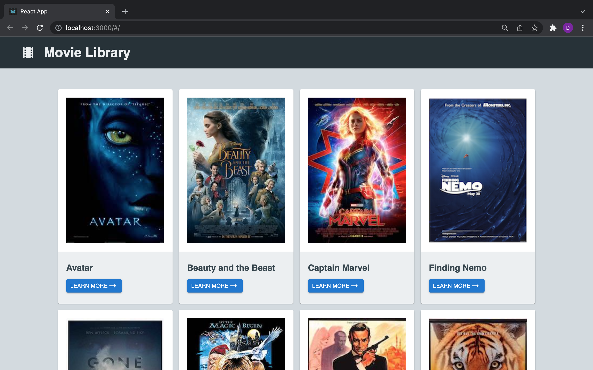
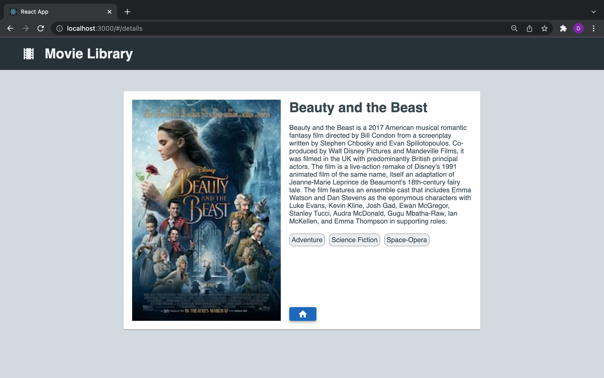

# Movie Library

## Description

This project features a movie library where users can explore movies listed and click to learn more about a selected movie. There are two views: one for the library and one for the details of a movie when the "learn more" button is clicked.

### Instructions 
Click on the "learn more" button to see details about a particular movie. The home button will bring you back to the main view.

### Duration 

The total duration of the project was roughly ~16 hours. 

### What problem was solved? 

As I've progressed in the program at Prime Digital Academy, one common theme I've found in my work is my commitment to planning. Below is a quick list of steps I took in this project to ensure the overall design is accompanied by strong and efficient functionality.

- Plan out objectives pertaining to the project and create a list of to-dos reflecting each objective
- Sketch a quick wireframe for each component related to the overall product to grasp an idea of the final look and assist in breaking up tasks
- Set up server API endpoints and test results using Postman
- Configure reducers in Redux and watchers in Saga to connect with the server when a dispatch is made for data in the database
- Test the full stack and troubleshoot issues that arise
- Stylize rendered elements to reflect initial wireframe (one view at a time)

## Wireframes

### Built with:
- Redux 
- React
- JavaScript
- CSS3/Material UI 
- Node.js
- postgreSQL   

### Acknowledgement

This project is implemented into the curriculum taught at Prime Academy to strengthen our understanding of react as it relates to the fullstack.